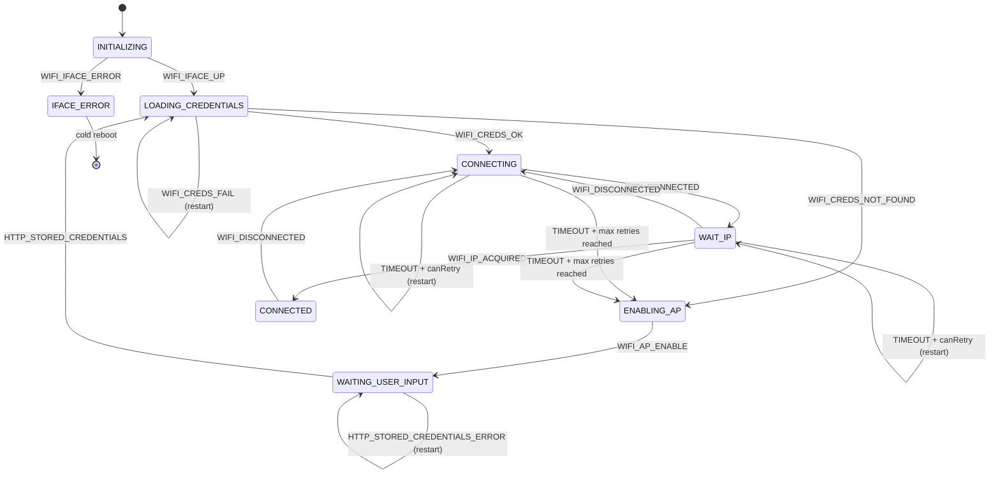

# Netmgnt WiFi State Machine

## Overview

The `Netmgnt` class implements a finite state machine that manages the full lifecycle of the WiFi connection. It coordinates four subsystems — WiFi driver, MQTT client, LED indicator, and an HTTP provisioning server — and transitions between states in response to network events delivered through a message queue.

The machine starts automatically when `start()` is called, which spawns a dedicated dispatch thread (`network_evt_dispatch_task`). That thread reads events from `net_evt_queue` in a blocking loop and feeds them into `process_state()`. State changes are handled through three methods: `on_exit()`, which cleans up the current state; `transition()`, which updates the state variable; and `on_entry()`, which initializes the new state.

---

## States

**Initializing** — the entry point. Calls `wifi_init()` and sets the LED red. Waits for the WiFi interface to come up before moving forward. If the interface fails entirely, it transitions to the error state.

**Loading credentials** — retrieves stored WiFi credentials. On success, proceeds to connect. If no credentials are found, it skips directly to AP mode so the user can provision the device. If loading fails, it restarts the same state.

**Connecting** — calls `connect_to_wifi()` and waits for a connection event. Supports configurable retries (`CONFIG_NETWORK_CONNECTION_MAX_TRIES`). On each timeout it restarts the state; once retries are exhausted it falls through to AP mode. Stray `WIFI_DISCONNECTED` events are ignored here.

**Wait for IP** — sets the LED yellow and starts DHCP. Waits for an IP address to be acquired. Handles disconnection by falling back to the Connecting state, and timeouts with the same retry/fallback logic as Connecting.

**Connected** — the operational state. Starts the RSSI monitor (a delayable work item that updates the LED brightness periodically) and releases the MQTT client. Any disconnection event immediately transitions back to Connecting.

**Enabling AP** — sets the LED blue and initialises the soft access point. Waits for the AP to signal it is up before moving to the next state.

**Waiting user input** — starts the HTTP server so the user can submit new WiFi credentials through a captive portal. On success, transitions back to Loading credentials. On error, restarts the HTTP server.

**Iface error** — a terminal state reached only if the WiFi interface itself fails during initialization. Logs the error and performs a cold system reboot after a short delay.

---

## State diagram

---

## Entry and exit actions

| State | On entry | On exit |
|---|---|---|
| INITIALIZING | LED red, reset tries, wifi_init() | — |
| LOADING_CREDENTIALS | set_credentials() | — |
| CONNECTING | wifi_disconnect() if retrying, connect_to_wifi() | reset tries on leaving to a different state |
| WAIT_IP | LED yellow, start_dhcp() | reset tries on leaving to a different state |
| CONNECTED | init RSSI monitor, release MQTT, start_mqtt() | block MQTT, cancel RSSI work |
| ENABLING_AP | LED blue, ap_init() | — |
| WAITING_USER_INPUT | http.start() | http.stop(), ap_stop() on leaving |
| IFACE_ERROR | log error, reboot | — |

---

## Retry logic

Both the Connecting and Wait-for-IP states use `canRetry()`, which increments an internal counter and returns true while it is below `CONFIG_NETWORK_CONNECTION_MAX_TRIES`. The counter resets whenever the state is left for a different state (handled in `on_exit()`). A `restart_state()` call re-runs `on_exit()` and `on_entry()` on the current state without changing the state variable.
