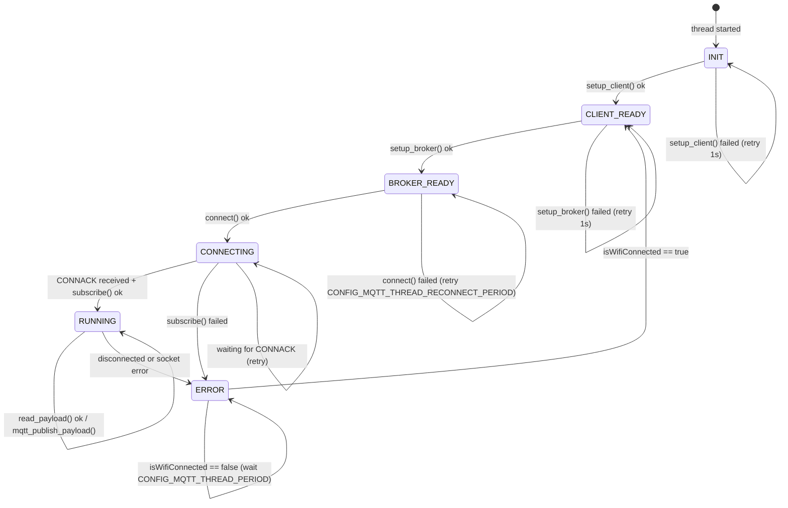
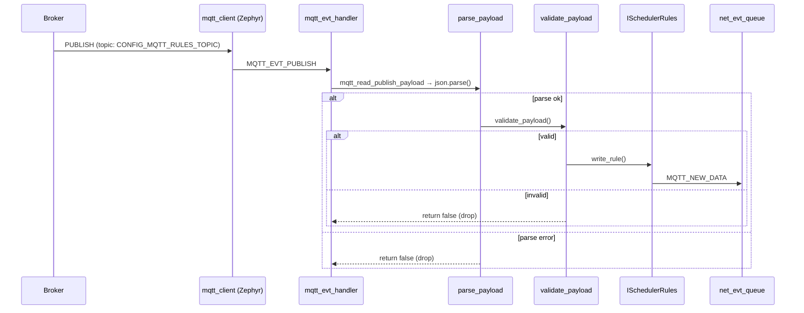

# MQTT module

## Overview

The `MQTT` class manages the full lifecycle of a broker connection in a dedicated thread. It handles client initialisation, broker DNS resolution, TCP/TLS connection, topic subscription, inbound payload processing, outbound sensor data publishing, and keepalive. It also owns its own internal state machine that runs independently from the WiFi state machine in `Netmgnt`.

The module integrates three injected dependencies: a watchdog (`IWatchDog`) that must be fed regularly to prove the thread is alive, a JSON codec (`IJson`) for encoding and decoding payloads, and a rules store (`ISchedulerRules`) where validated inbound rules are stored.

Communication with the rest of the system follows the same queue-based event engine used by the WiFi modules: events are pushed to `net_evt_queue` with a `MQTT_EVT` type tag. Additionally, the module exposes two control methods — `block_mqtt()` and `release_mqtt()` — that `Netmgnt` calls to gate the state machine on WiFi availability without stopping the thread.

---

## Internal state machine

The MQTT thread runs a self-contained state machine in `mqtt_task()`. It progresses linearly from initialisation to running, retrying each step on failure. The only way to move backward is through the `ERROR` state, which blocks until `Netmgnt` signals that WiFi is available again by calling `release_mqtt()`.

The `isWifiConnected` flag is the only coupling between this state machine and the network manager. `Netmgnt` sets it to `false` via `block_mqtt()` when WiFi drops, and back to `true` via `release_mqtt()` when the `CONNECTED` state is entered. This prevents the MQTT machine from spinning through reconnect attempts while the network is known to be down.

---

## Thread lifecycle and watchdog

`start_mqtt()` creates the thread with the `K_ESSENTIAL` flag, meaning a crash in this thread will trigger a fatal system error. The thread registers itself with the task watchdog on startup and must call `_guard.feed()` on every iteration where it does not block. If the thread stalls — for example on a blocking socket operation that never returns — the watchdog fires.

The only path where the thread is stopped intentionally is `MQTT::abort()`, called by `Netmgnt::stop()`. It disconnects gracefully if connected, then calls `mqtt_abort()` and `k_thread_abort()`.

---

## Inbound payload flow

Inbound data arrives through `MQTT_EVT_PUBLISH` in `mqtt_evt_handler`, which delegates to `on_mqtt_publish`. The payload is read from the MQTT client buffer, null-terminated, parsed into a `Rules_t` struct via the JSON codec, validated, and written to the rules store. A `MQTT_NEW_DATA` event is pushed to the queue only if all three steps succeed.

Validation enforces the following constraints:

- `period` must be either `WEEKLY` or `SPECIF`.
- For `WEEKLY`: `week_days` mask must be between 1 and `MAX_WEEK_DAYS_MASK_VALUE` (0x7F).
- For `SPECIF`: `day` and `month` must be within the allowed calendar range.
- In all cases: `hour` must be within 0–`MAX_HOUR_TIME_VALUE` and `minutes` within 0–`MAX_MINUTE_TIME_VALUE`.

---

## Outbound publish flow

Sensor data arrives from a separate `mqtt_publish_queue` message queue. On each `RUNNING` iteration, after `read_payload()` returns, `mqtt_publish_payload()` does a non-blocking `k_msgq_get`. If data is available it encodes it to JSON via `IJson::encode`, constructs a `mqtt_publish_param` for `CONFIG_MQTT_SENSOR_TOPIC` at QoS 0, and calls `mqtt_publish`. If the queue is empty the call returns immediately with no side effects.

---

## Broker setup

`setup_broker()` supports two resolution modes selected at build time:

- `CONFIG_MQTT_USE_BROKER_DNS`: resolves `CONFIG_MQTT_BROKER_ADDR` with `zsock_getaddrinfo`. The resolved address is cached in `isBrokerSeted`; subsequent reconnect attempts skip resolution if the flag is already set.
- Direct IP: converts `CONFIG_MQTT_BROKER_ADDR` with `zsock_inet_pton`.

TLS is conditionally compiled under `CONFIG_MQTT_TLS_ENABLE`. When enabled, the transport is switched to `MQTT_TRANSPORT_SECURE`, the CA certificate is registered as a TLS credential, and the broker port changes to `CONFIG_MQTT_BROKER_PORT_TLS`.

---

## Events produced

| Event | Trigger |
|---|---|
| `MQTT_CONNECTED` | `MQTT_EVT_CONNACK` with result 0 |
| `MQTT_DISCONNECTED` | `MQTT_EVT_DISCONNECT` |
| `MQTT_NEW_DATA` | inbound payload parsed, validated, and written successfully |
