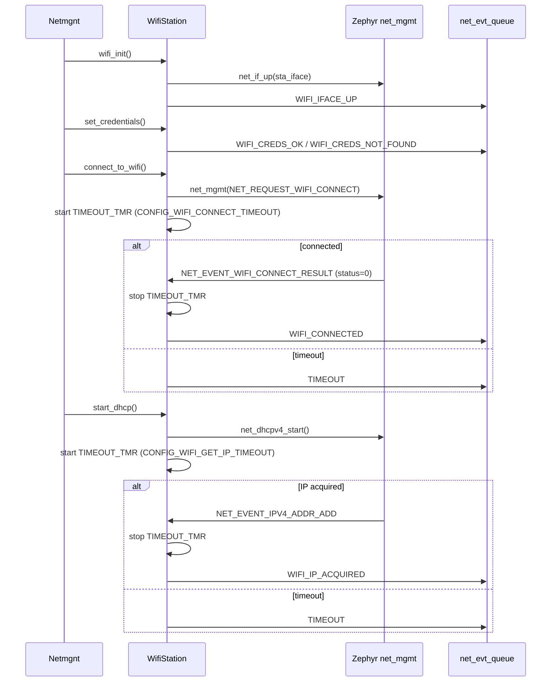
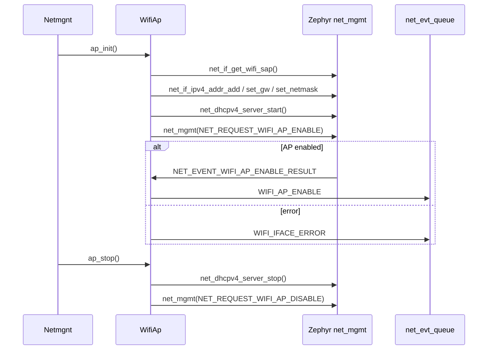

# WiFi modules

## Event engine

Both modules communicate with `Netmgnt` through a shared message queue (`net_evt_queue`). Neither module calls into the manager directly. Instead, whenever something meaningful happens — a connection result, a timeout, an IP address arriving — the module constructs an `EventMsg` and pushes it onto the queue with `k_msgq_put`. The dispatch thread in `Netmgnt` reads from that queue and feeds the event into `process_state()`.

This decouples the event sources from the state machine. The WiFi driver callbacks and the timer handler run in whatever context Zephyr delivers them (net_mgmt thread, ISR), and they only need to do one non-blocking write to the queue. All state logic stays in one place and executes sequentially on the dispatch thread.

```
WifiStation / WifiAp
  net_mgmt callback / k_timer handler
        |
        | k_msgq_put(&net_evt_queue, &msg, K_NO_WAIT)
        v
  net_evt_queue  (k_msgq)
        |
        | k_msgq_get — blocking, dispatch thread
        v
  Netmgnt::process_state(evt)
```

Every `EventMsg` carries two fields: the event enum value (`evt`) and a type tag (`WIFI_EVT` or `HTTP_EVT`). The type tag lets `Netmgnt` decide whether to route the event through `process_state()` or only forward it to registered listeners.

---

## WifiStation

Manages the STA (station) interface. Responsible for credential loading, connection requests, DHCP, RSSI queries, and connection timeout enforcement.

Two `net_mgmt` callbacks are registered on init: one for WiFi events (connect/disconnect results) and one for IPv4 events (DHCP start, address acquired). A single `k_timer` serves both the connection timeout and the DHCP timeout — it is started when a connection or DHCP request is issued and stopped as soon as the expected result arrives.



### Events produced

| Event | Trigger |
|---|---|
| `WIFI_IFACE_UP` | `net_if_up` succeeded |
| `WIFI_IFACE_ERROR` | interface is NULL or `net_mgmt` call failed |
| `WIFI_CREDS_OK` | both SSID and PSK read from storage |
| `WIFI_CREDS_NOT_FOUND` | either key missing from storage |
| `WIFI_CONNECTED` | `NET_EVENT_WIFI_CONNECT_RESULT` with status 0 |
| `WIFI_DISCONNECTED` | `NET_EVENT_WIFI_DISCONNECT_RESULT` |
| `WIFI_IP_ACQUIRED` | `NET_EVENT_IPV4_ADDR_ADD` |
| `TIMEOUT` | `k_timer` expired before connect or IP result |

---

## WifiAp

Manages the soft AP (SAP) interface. Responsible for starting the access point, configuring a static IP and a DHCPv4 server for connecting clients, and tearing everything down cleanly.

One `net_mgmt` callback is registered on `ap_init()` covering AP enable/disable results and station join/leave events. The static IP, netmask, gateway, and DHCP pool base address are all taken from Kconfig values (`CONFIG_WIFI_AP_IP`, `CONFIG_WIFI_AP_MASK`, `CONFIG_WIFI_AP_SSID`, `CONFIG_WIFI_AP_PSK`). The DHCP pool start address is derived by incrementing the last octet of the AP address by 10.



### Events produced

| Event | Trigger |
|---|---|
| `WIFI_AP_ENABLE` | `NET_EVENT_WIFI_AP_ENABLE_RESULT` received |
| `WIFI_AP_DISABLED` | `NET_EVENT_WIFI_AP_DISABLE_RESULT` received |
| `WIFI_IFACE_ERROR` | SAP interface is NULL or AP enable request failed |
